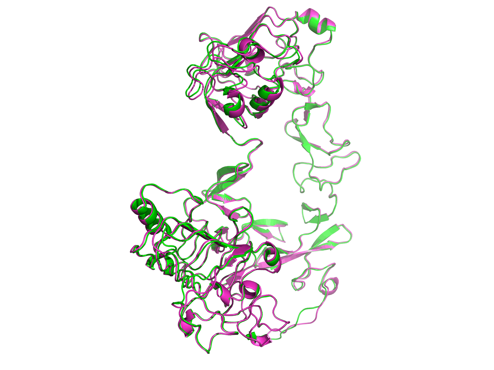

# OrthoScope
An automated tool for generating comprehensive protein analysis that retrieve, analyze, and visualize protein information across multiple organisms.
## Features
- **Multi-source Data Retrieval**: Fetches protein data from UniProt, AlphaFold, STRING DB, and NCBI
- **Ortholog Finding**: Starting from a human UniProt entry, identifies orthologs across:
  - Mouse (Mus musculus)
  - Alpaca (Vicugna pacos)
  - Cynomolgus monkey (Macaca fascicularis)
  - Chicken (Gallus gallus)
  - Rabbit (Oryctolagus cuniculus)
  - Llama (Lama glama)
- **Custom Organisms**: Add your own organisms by providing scientific name and NCBI taxonomic ID
- **Sequence Analysis**: Annotates protein sequences (GenBank output via Biopython) and aligns them across orthologs using MAFFT
- **Structural Analysis**:
  - Retrieves AlphaFold predicted structures
  - Annotates 3D structures with domain information
  - Performs structural alignments and calculates RMSD values
- **Interaction Networks**: Retrieves protein-protein interaction data from STRING DB
- **Interactive Web Display**: Renders all analysis results (protein summary, domain map, 3D structure, sequence, ortholog alignments, STRING network) in the Next.js frontend, with structures shown in an interactive Mol\* viewer
## Example output
[`examples/EGFR/`](examples/EGFR/) holds a real run against human EGFR (`P00533`) with mouse and chicken orthologs — annotated GenBank, per-organism FASTA/GFF, the MAFFT alignment, and the rendered structure, superposition, and STRING network images. Worth a look before installing anything.

*Human EGFR (green) superposed with mouse Q01279 (magenta), rendered by PyMOL.*
## Requirements
- Python 3.10–3.12 (the code uses `X | Y` type syntax and `list[...]` generics)
- Node.js 18+ (for the frontend)
- PyMOL (for structural alignment and structure image rendering) — installed from PyPI as `pymol-open-source-whl`, no separate install needed
- MAFFT (for multiple sequence alignment) — has no PyPI distribution, so it comes from conda/brew/apt
## Installation
### Option A: Docker (recommended)
Requires Docker with Compose. Nothing else — MAFFT and PyMOL are baked into the image.
```bash
git clone <repository-url>
cd orthoscope
docker compose up --build
```
Open http://localhost:3000. Artefacts are written to the `orthoscope-data` volume and served from the API's `/files` route, so results survive a container restart.
The backend image is `linux/amd64` only, because open-source PyMOL publishes no `linux/arm64` wheel. On Apple Silicon it runs under emulation.
### Option B: Conda
```bash
git clone <repository-url>
cd orthoscope
conda env create -f environment.yml
conda activate orthoscope
```
This installs Python, MAFFT, and everything in `requirements.txt` (including PyMOL).
### Option C: pip + system MAFFT
```bash
python3.10 -m venv .venv
source .venv/bin/activate
pip install -r requirements.txt
brew install mafft          # or: conda install -c bioconda mafft / apt install mafft
```
Verify MAFFT is on your `PATH` with `mafft --version`. Without it, the pipeline still completes but reports the alignment stage as a warning.
### Configuration
Both backend settings are optional environment variables:
| Variable | Default | Purpose |
| --- | --- | --- |
| `ORTHOSCOPE_DATA_DIR` | repository root | Where `output_<protein>/` trees are written and what `/files` serves |
| `ORTHOSCOPE_CORS_ORIGINS` | `http://localhost:3000` | Comma-separated list of origins allowed to call the API |
The frontend reads `NEXT_PUBLIC_API_BASE` (default `http://localhost:8000`). Because it is a `NEXT_PUBLIC_*` value it is inlined at build time, so changing it requires a rebuild, not just a restart.
## Usage
### Running the Application
Start the FastAPI backend:
```bash
cd src
uvicorn api:app --reload --port 8000
```
In a second terminal, start the Next.js frontend:
```bash
cd frontend
cp .env.local.example .env.local   # edit if backend isn't on localhost:8000
npm install
npm run dev
```
Open http://localhost:3000 in your browser. See [frontend/README.md](frontend/README.md) for frontend details.
### Input
Enter a protein name (short symbol used for filenames, e.g. `EGFR`) and a human UniProt accession (e.g. `P00533`).
### Process Flow
1. Enter the protein name and UniProt accession
2. Select predefined organisms to use as orthologs (all selected by default)
3. Optionally add custom organisms with scientific name and NCBI taxonomic ID
4. Click "Run query" to start the process
The application will:
1. Retrieve protein information from UniProt
2. Find orthologs across the selected organisms (see [Ortholog Finding Process](#ortholog-finding-process))
3. Annotate and align sequences
4. Perform structural alignments
5. Retrieve STRING DB interactions
6. Render all results in the web UI as one page of sections (Orthologs / Domains / Structure / Sequence / Interaction network)
The pipeline runs synchronously; submitting a new job replaces the previous result on screen. Only the UniProt lookup, human protein assembly, and file write are required — if alignment, structure, or network steps fail, the job still returns with a list of warnings shown above the results.
### Organism Selection
- **Predefined Organisms**: Checkboxes for all available organisms (all selected by default)
- **Custom Organisms**:
 - Enter scientific name (e.g., "Canis lupus")
 - Enter NCBI taxonomic ID (e.g., 9615)
 - Click "Add" to add it to your list
 - Predefined organisms can be selected/deselected; custom organisms can be removed individually
### Ortholog Finding Process
The program uses a two-step approach to find UniProt entries for orthologs:
#### Step 1: NCBI Ortholog Finder (Primary Method)
1. **Extract Gene ID**: The program extracts the NCBI GeneID from the human UniProt entry's cross-references.
2. **Query NCBI Ortholog API**:
  - Uses the NCBI Datasets API (`/datasets/v2/gene/id/{gene_id}/orthologs`) to find ortholog genes
  - Filters by the taxonomic IDs of selected organisms
  - Returns a list of ortholog gene reports
3. **Find Protein References**:
  - For each ortholog gene found, the program scrapes the NCBI Gene page
  - Searches for protein reference sequences in priority order:
    1. **UniProtKB/Swiss-Prot** entries (curated, highest quality)
    2. **UniProtKB/TrEMBL** entries (unreviewed but in UniProt)
    3. **RefSeq** entries (NCBI protein database, fallback)
  - Returns a tuple indicating the source: `('uniprot', uniprot_id)` or `('ncbi', refseq_id)`
4. **Retrieve Protein Data**:
  - If a UniProt ID is found, retrieves the full UniProt entry via UniProt API
  - If only a RefSeq ID is found, retrieves the FASTA sequence from NCBI
#### Step 2: UniRef Ortholog Finder (Fallback Method)
For organisms not found via NCBI, the program uses UniRef clusters:
1. **Query UniRef Cluster**:
  - Retrieves the UniRef cluster data for the human protein
  - Searches cluster members for entries matching:
    - The target organism's taxonomic ID
    - The same protein name (recommended name)
2. **Verify and Retrieve**:
  - If found in UniRef cluster, retrieves the UniProt entry
  - Cross-references with a UniProtKB search to verify correctness
  - If multiple matches exist, selects the first result automatically
3. **Direct UniProtKB Search** (if not in UniRef):
  - Performs a search in UniProtKB using:
    - Protein recommended name
    - Gene name
    - Organism taxonomic ID
  - Returns the first matching result
#### Result Processing
- **UniProt Entries**: Full protein data including sequence, annotations, cross-references, and AlphaFold structures
- **NCBI RefSeq Entries**: FASTA sequence only (no structure data available), so these are excluded from structural alignment
- **Missing Orthologs**: If no ortholog is found for a selected organism, or the ortholog has no AlphaFold structure, it is skipped in the final output and reported as a warning
This dual-method approach ensures maximum coverage: NCBI provides high-quality ortholog relationships, while UniRef/UniProtKB search catches cases where NCBI data is incomplete or unavailable.
## Output
The application generates:
- **Web Results View**: A single results page in the Next.js frontend containing:
 - Summary: protein information table (name, aliases, gene ID, UniProt accession, length, mass) plus any pipeline warnings
 - Orthologs: ortholog accessions, RMSD values, per-organism downloads, and superposed structures in the Mol\* viewer
 - Domains: annotated feature tracks along the sequence, with a full feature table
 - Structure: interactive AlphaFold model and the PyMOL image colored by feature
 - Sequence: human residues plus FASTA, annotated GenBank, and MAFFT alignment downloads
 - Interaction network: STRING-DB interaction network image
- **Output Files**: Organized in `output_<protein_name>/` directories:
 - FASTA sequence files (per organism, plus a combined input file)
 - GFF annotation files
 - Annotated GenBank record for the human protein
 - MAFFT alignment FASTA
 - PDB structure files, including superposed copies under `aligned_structures/`
 - PNG images of structures and alignments
 - PyMOL session files
## Technical Details
### Ortholog Finding Strategy
The program employs a hierarchical approach to maximize ortholog discovery:
1. **NCBI First**: Uses NCBI's curated ortholog database for reliable gene-level ortholog relationships
2. **UniRef Fallback**: Uses UniRef clusters to find sequence-similar proteins when NCBI data is unavailable
3. **UniProtKB Search**: Direct search as final fallback for edge cases
This ensures that even if an organism isn't in NCBI's ortholog database, the program can still find related proteins through sequence similarity.
### Data Sources Priority
When multiple protein references are available, the program prioritizes:
1. UniProtKB/Swiss-Prot (curated, reviewed)
2. UniProtKB/TrEMBL (unreviewed but in UniProt)
3. NCBI RefSeq (fallback, sequence only)
## Notes
- The application requires internet connectivity to fetch data from external APIs
- Processing time depends on the number of proteins and available orthologs
- Ensure sufficient disk space for output files and structures
- PyMOL must be properly configured for 3D structure visualization
- Custom organisms require valid NCBI taxonomic IDs - verify IDs at [NCBI Taxonomy](https://www.ncbi.nlm.nih.gov/taxonomy)
- Some organisms may not have orthologs available in databases - these will be skipped automatically